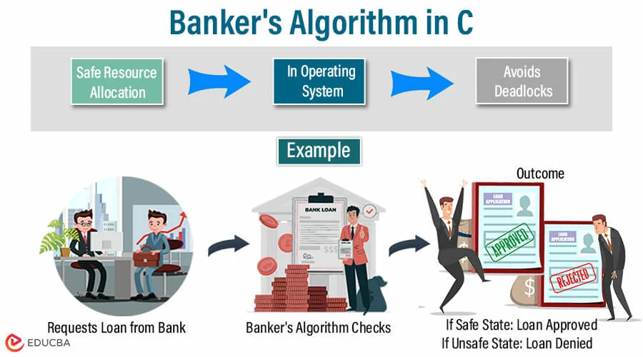

# 🏦 Banker's Algorithm – Deadlock Avoidance

This directory contains an implementation of the classic Banker's Algorithm used for deadlock avoidance in operating systems.

> Developed by Edsger Dijkstra, the Banker's Algorithm ensures a system does not enter a deadlock state by allocating resources only if it leaves the system in a safe state.

---

## 📚 Problem Overview

In a multi-process system, processes request resources (like CPU cycles, memory, IO devices). To prevent deadlocks, the OS checks if allocating resources to a process keeps the system in a "safe state."

The Banker's Algorithm does this using:
- The current resource allocation
- The maximum demand of each process
- The resources still available

---

## 🧠 Key Concepts

- 🧮 Safe State: All processes can finish without leading to a deadlock.
- 📉 Deadlock: A state where no process can proceed because each is waiting for another to release resources.
- 💼 Allocation Matrix: What each process currently holds.
- 🔒 Max Matrix: Maximum resources each process may need.
- 🧾 Need Matrix: max - allocated
- 🪙 Available: Unallocated resources in the system.

---
## Anology : 


## 🛠️ How to Compile and Run

Ensure you have a C compiler like gcc:

```bash
gcc bankers_algorithm.c -o bankers
./bankers
````

You will be asked to input:

* Number of processes and resource types
* Allocation matrix
* Maximum matrix
* Available resources

---

## 🔢 Sample Input

```
Enter number of processes: 5
Enter number of resource types: 3

Enter Allocation Matrix:
[0, 1, 0]
[2, 0, 0]
[3, 0, 2]
[2, 1, 1]
[0, 0, 2]

Enter Max Matrix:
[7, 5, 3]
[3, 2, 2]
[9, 0, 2]
[2, 2, 2]
[4, 3, 3]

Enter Available Resources:
[3, 3, 2]
```

---

## ✅ Sample Output

```
Safe sequence is: P1 -> P3 -> P4 -> P0 -> P2
System is in a safe state ✅
```

If no safe sequence exists, the algorithm reports:

```
System is not in a safe state ❌
```

---

## 🖼️ Visual Reference


---

## 📚 Further Learning

* [GeeksForGeeks – Banker's Algorithm](https://www.geeksforgeeks.org/bankers-algorithm-operating-system-2/)
* [Wikipedia – Banker's Algorithm](https://en.wikipedia.org/wiki/Banker%27s_algorithm)
* OS Concepts by Galvin – Deadlock Avoidance Chapter

---

## 📄 License

MIT License – use, modify, and share freely.

---

## 🙌 Contributing

Want to add input validation, visualization, or extend it to dynamic requests? Go ahead!

1. Fork this repo
2. Create a feature branch
3. Submit a pull request 🚀

Let’s keep deadlocks out of our code!

```


