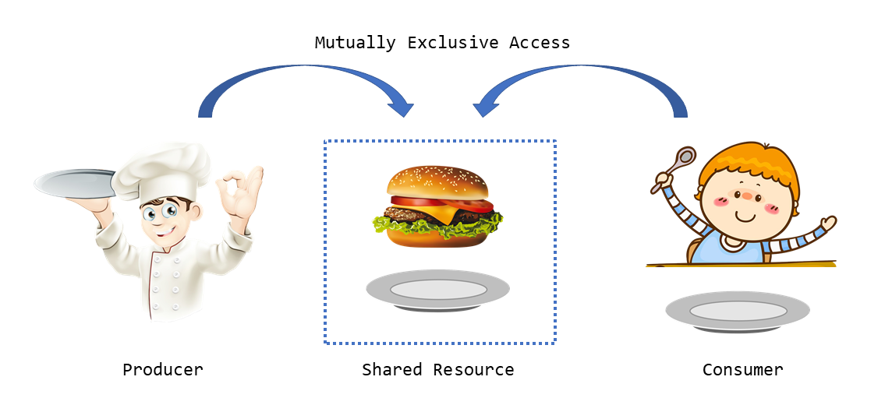

# 🧵 Producer-Consumer Problem

This project simulates the **Producer-Consumer Problem** using **C, pthreads, and semaphores**. It demonstrates how to manage concurrent access to a shared buffer with limited size.

---

## 📌 What is the Producer-Consumer Problem?

A classic synchronization problem where:

- The **Producer** generates data and stores it in a shared buffer.
- The **Consumer** takes data from the buffer and processes it.
- The **buffer** has limited space (a circular queue).
- We use **semaphores and mutexes** to prevent:
  - Overfilling the buffer
  - Consuming from an empty buffer
  - Race conditions (simultaneous access)

---

## ⚙️ Tools & Concepts

- **Language**: C
- **Libraries**: `pthread.h`, `semaphore.h`, `unistd.h`
- **Concepts**: Semaphores, Mutexes, Critical Sections, Synchronization

---

## 🧠 Real-World Analogy

| Producer (Chef) | Buffer (Table) | Consumer (Customer) |
|------------------|----------------|----------------------|
| Prepares food     | Holds dishes   | Eats food            |

---

## 🖼️ Diagram



---

## 🧪 Sample Output

```
Produced: 42 at index 0
Consumed: 42 from index 0
Produced: 17 at index 1
...
```

---

## 🧾 How to Compile and Run

```bash
gcc producer_consumer.c -lpthread -o producer_consumer
./producer_consumer
```

---

## 📚 Further Reading

- [GeeksForGeeks – Producer-Consumer](https://www.geeksforgeeks.org/producer-consumer-problem-using-semaphores/)
- [Wikipedia – Producer-Consumer Problem](https://en.wikipedia.org/wiki/Producer%E2%80%93consumer_problem)
- [Little OS Book (Free)](https://littleosbook.github.io/)
- [FreeCodeCamp – OS Crash Course](https://www.freecodecamp.org/news/os-crash-course/)

---

## 📄 License

MIT License – Feel free to use, modify, and share this code.

---

## 🙌 Contribution

If you found this helpful, consider contributing improvements, examples in other languages, or adding diagrams!

